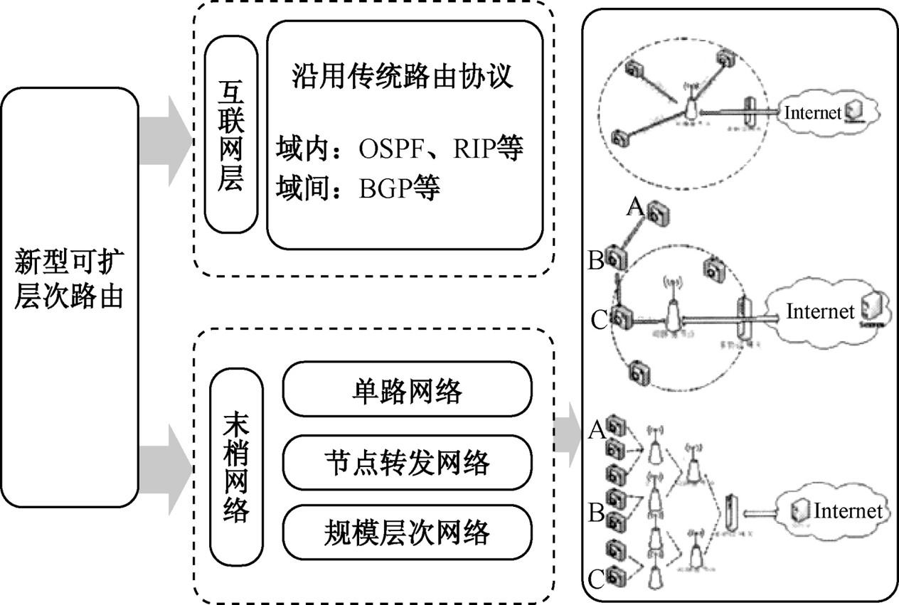

# 物联网与传感技术
## 物联网概述
### 导论
物联网是继**计算机、互联网和移动通信**之后的又一次信息产业革命。从“智慧地球”的理念到“感知中国”的提出，随着全球一体化、工业自动化和信息进程画的不断深入而悄然兴起。**物联网就在人们身边。**
### 定义
物联网是通过各种**信息感知**设施，按约定的**通信协议**将智能物件互联起来，通过各种通信网络进行信息**传输与交换**，以实现决策与控制的一种**信息网络**。
### 政府工作报告注释
物联网是指通过信息传感设备，按照约定的协议，把任何物品与互联网连接起来，进行信息交换和通讯，以实现智能化识别、定位、跟踪、监控和管理的一种网络。它是在互联网基础上延伸和拓展的网络。
### 物联网与其他网络
#### 物联网
物联网是一种关于**人与物、物与物**广泛互联，实现人与客观世界进行信息交互的信息网络。

从技术层面上说，物联网是指实现**智能物件互联互通的信息网络**。物联网可以提供**所有对象**在**任何时间、任何地点的互联**。

从应用的角度理解，物联网主要是在提升数据传送效率、改善民生、提高生产率、降低企业管理成本的方面发挥着重要作用。

    如，就电信运营的产业链而言，物联网的内涵主要是基于特定的终端，以有线或无线(IP/CDMA)等为接入手段，为集团和家庭客户提供机器到机器、机器到人的解决方案，满足客户对生产过程/家居生活监控、指挥调度、远程数据采集和测量、远程诊断等方面的信息化需求。
#### 传感网
传感网是由若干具有**无线通信与计算能力的感知节点，以网络为信息传递载体，实现对物理世界的全面感知而构成的自组织分布式网络**。传感网的突出特征是采用只能计算技术对信息进行分析下处理，从而提升对物质世界的感知能力，实现智能化的决策和控制。 
    
传感网作为**传感器、通信和计算机**三项技术密切结合的产物，是一种全新的数据获取和处理技术。
#### 泛在网
泛在网是面向泛在应用的各种**异构网络的集合**强调的是跨网之间的互联互通和数据融合、聚类与应用。
#### 互联网
互联网是指通过TCP/IP协议将异种计算机网络连接起来实现资源共享的网络技术，实现的是人与人之间的通信。
### 物联网的主要特征
- 全面感知
- 可靠传输
- 智能处理
- 自动控制
### 物联网的实现载体
- 元器件
    传感器、敏感器、电子元器件、数字/模拟/射频集成电路芯片
- 电路
    信号调理/处理电路、数字/模拟/射频混合电路、微处理器电路
- 系统
    嵌入式系统、射频识别系统、无线传感器网络节点系统、网络接入系统
- 网络
    异构网络、接入网、互联网、移动网
### 物联网体系结构
#### 体系结构的定义
体系结构（Architecture）是研究系统**各部分组成及相互关系**的技术科学。

    如，国际标准化组织（ISO）提出的开放系统互联（OSI)参考模型就是最著名的**计算机网络体系结构**。该网络体系结构定义了计算机设备和其他设备如何连接在一起以形成一个允许用户共享信息和资源的通信系统。

体系结构可以精确地定义**系统的组成部件及其之间的关系**，指导开发者**遵循一致的原则**实现系统，以保证最终建立的系统**符合预期的需求**。因此，物联网体系结构是设计与实现物联网系统的基础。
#### 物联网体系结构的构建原则
- 多样性
    物联网体系结构须根据**服务类型、节点的不同**，具有多种类型，能够平滑地**与互联网实现互联互通**。
- 包容性
    物联网体系结构应能满足在**时间、空间和能源**方面的需求，可以集成**不同的通信、传输和信息处理**技术，应用于不同的领域。
- 可扩展性
    物联网体系的框架应该具有一定的**扩展性**，以便最大限度地利用现有网络通信基础设施，保护已投资利益。
- 互操作性
    指不同的物联网系统可以按照约定的规则**互相访问、执行任务和共享资源**。
- 安全性
    指物联网系统可以保证**信息的私密性**，具有访问控制和抗攻击能力，具备相当好的健壮性。
#### 物联网体系结构模型
- 感知层
感知层位于底层，是实现物联网的基础，是联系物理世界与虚拟世界的纽带。
  - 感知控制层
    主要任务是实现**全面感知与自动控制**，即通过实现对物理世界**各种参数**（如环境温度、湿度、压力、气体浓度等）的采集与处理，以根据其需要进行行为自动控制。
  - 数据融合层
    将**不同感知节点、不同模式、不同媒质、不同时间、不同表示的数据**进行**相关和综合**，以获得对被感知对象的更精确描述。融合处理的对象不局限于接收到的初级数据，还包括对多源数据进行不同层次抽象处理后的信息。
- 网络层
网络层于物联网体系结构的中间，为应用层提供数据传输服务，因此也可称为传输层。鉴于物联网的网络规模、传输技术的差异性，将网络层分为接入、汇聚和核心交换3个子层。
  - 接入层
  主要任务是把**感知层获取的数据信息**通过各种**网络技术**进行**汇总**，将大范围内的信息整合到一起，以供传输与交换。
  - 汇聚层
  是**区域性网络的信息汇聚点**,为接入层提供数据汇聚、传输、管理、分发。
  - 核心交换层
  主要为物联网提供高速、安全、具有服务质量保障力的通信环境。
- 应用层
利用经过分析处理的感知数据，为用户提供不同类型的特定服务，主要功能是**解决数据处理和人机交互问题**。应用层按功能可划分为智能处理、应用接口两个子层。应用层是物联网应用的体现。
  - 智能处理层
  对感知数据的**存储、查询、分析、挖掘、理解**，以及基于感知数据的决策和行为控制。
  - 应用接口层
  主要任务就是将智能处理层提供的数据信息，按照业务应用需求，采用软件工程方法，完成**服务发现和服务呈现**，包括对采集数据的汇聚、转换、分析，以及用户层呈现的适配和事件触发等。
- 支持物联网共性需求的功能面
物联网体系结构还应包括贯穿各层的网络管理、服务质量（QoS）、信息安全等共性需求的功能面，为用户提供各种具体的应用支持。
  - 网络管理
  指通过某种方式对网络进行管理，使网络能正常高效地运行。
  - 服务质量
  是相对网络业务而言的，在保证某类业务服务质量的同时，可能是在损害其它业务的服务质量。
  - 信息安全
  物联网信息安全包括物理安全、信息采集安全、信息传输安全和信息处理安全，目标是确保信息的机密性、完整性、真实性和网络的容错性。
#### 物联网架构与技术
- 标识层
    传感器、二维条码、RFID、多媒体信息
- 感知层
    低速与中高速短距离传输技术、自组织组网技术、协同信息处理技术、传感器中间件技术
- 网络层
    异构网统合、资源与存储管理、专用网络、远程控制、下一代承载网、M2M无线接入、移动通信网、互联网
- 应用层
    环境监测、智能电力、智能交通、工业监控、公共中间件、信息开放平台、云计算平台、服务支撑平台
- 公共技术
    标识解析、安全技术、QoS管理、网络管理
#### 物联网的EPC体系结构
- EPC编码
- EPC标签
- RFID读写器
- 中间件系统
- ONS服务器
- EPC IS服务器
 
### 物联网技术体系
物联网具有**网络的异构性、规模的差异性、接入的多样性**等特点，因此需要有一个可扩展的、分层的、开放的基本技术体系架构。
通过对物联网体系结构的分析，从物联网工程的角度，可以将实现物联网的关键技术归纳为
- 感知控制
    信息获取
- 网络传输
    主要为传感网、通信网络
- 系统应用
    包括中间件、云计算、数据挖掘、模式识别、运营平台、行业接口、系统集成、专家系统

 
#### 感知控制技术
节点感知控制技术是实现物联网的**基础**。它主要包括用于对物质世界进行感知识别的**电子标签技术、RFID技术、智能传感器技术、智能化传感网节点技术、全球定位系统（GPS），以及数据融合与处理技术**。
##### 电子标签技术
在感知技术中，电子标签用于对**采集点信息进行标准化标识**。

编码技术是EPC的核心，该编码可以实现单品识别，使用射频识别系统的读写器可以实现对**EPC标签信息的读取**，互联网EPC体系中实体标记语言服务器把获取的信息进行处理，服务器可以根据**标签信息实现对物品信息的采集和追踪**，利用EPC体系中的网络中间件等，对所采集的EPC标签信息进行管理。
##### RFID技术
RFID是一种**非接触式的自动识别技术**，属于近程通信，与之相关的技术还有**蓝牙**（Bluetooth）技术等。RFID通过**射频信号自动识别目标对象并获取相关数据**, 识别过程无须人工干预, 可工作于各种恶劣环境。RFID使用射频信号对目标对象进行自动识别，获取相关数据，目前该方法是物品识别最有效的方式。
##### 智能传感器技术
传感器是节点**感知物质世界的“感觉器官”**, 用来感知信息采集点的环境参数。传感器可以感知**热、力、光、电、声、位移**等信号, 为物联网系统的处理、传输、分析和反馈提供最原始的数据信息。
##### 智能化传感网节点技术
智能化传感网节点是指一个**微型化的嵌入式系统**。在**感知物质世界及其变化**的过程中, 需要检测的对象很多, 譬如温度、压力、湿度、应变等。
##### GPS技术
全球定位系统（GPS）是美国从20世纪70年代开始研制，于1994年全面建成，具有海、陆、空全方位实时三维导航与定位能力的新一代**卫星导航与定位系统**。GPS由空间星座、地面控制和用户设备等3部分构成。
##### 数据融合与处理
在传感网应用中，多数情况只关心**监测结果**，并不需要收到大量原始数据，数据融合是处理该类问题的有效手段。例如，借助数据稀疏性理论在图像处理中的应用，可将其引入传感网数据压缩，以改善数据融合效果。
#### 网络传输技术
##### 接入网技术
- **传感网技术**
- **ZigBee技术**
- 蓝牙技术
##### 汇聚网技术
- 无线网络技术
    无线个域网、无线局域网/城域网、3G/4G移动通信网，以及专用无线通信技术
- 有线通信网络技术
    局域网、工业现场总线网络，以及电话交换网等
##### 承载网技术
- 核心承载网络
    可以是公共通信网，如3G/4G移动通信网，或者是SDH/MSTP技术、PTN技术、光传送网（OTN）,或者是互联网、移动互联网、企业专用网或者卫星通信等。
- 软件定义网络（SDN）
    是一种全新的网络技术，它通过分离网络设备的控制与数据面，将网络的能力抽象为应用程序接口（API）提供给应用层，从而构建开放可编程的网络环境，在对底层各种网络资源虚拟化的基础上，实现对网络的集中控制和管理。
#### 系统应用技术
物联网的系统应用技术包括了对**海量信息的智能处理**，建立起**专家系统、预测模型、行业接口和运营平台**，实现人机交互服务。
##### 海量数据智能处理
海量数据智能处理是指依托先进的**软件工程技术**，对物联网的各种数据进行**海量存储与快速处理**，并将处理结果实时反馈给网络中的各种“控制”部件。智能处理技术就是为了有效地达到某种预期目的，对数据进行知识分析所采用的各种方法和手段。
- 云计算
    云计算最基本的概念是透过网络将庞大的计算处理程序自动分拆成无数个较小的子程序，再交由多部服务器所组成的庞大系统经搜寻、计算分析之后将处理结果回传给用户。
- 数据挖掘
    数据挖掘是指利用**关联规则、分类与预测、聚类分析、序列分析、离群点、预测模型**等方法，从大量数据中提取或挖掘知识的过程。面对物联网的海量数据，必须借助智能处理方法包括大数据才能获得相关的知识。
##### 应用接口技术
应用层主要是集成系统底层的功能，根据行业特点，借助互联网技术手段，开发**各类应用接口和解决方案**，将物联网的优势与行业的**生产经营、信息化管理、组织调度**结合起来，构建智能化的应用服务方案。行业的智能应用涉及较多的系统集成、运营平台、行业接口。

专家系统是指含有大量的某个领域专家水平的知识库，能够利用人类专家的知识和经验处理该领域问题、进行智能决策的计算机程序系统。

另外，对于物联网而言，还需要许多**共性技术**的支持，例如，网络管理、对象名字解析（Object Naming Server，ONS）、服务质量保障和信息安全。其中，对象名字解析是在RFID应用中需解决的问题。在物联网中，ONS的功能与互联网的域名解析（DNS）功能类似。
### 物联网系统的组成及类型
#### 物联网硬件平台组成
物联网是以数据为中心的面向应用的网络，主要完成**信息感知、数据处理、数据回传**，以及决策支持等功能，其硬件平台可由**传感网、承载网和信息服务系统**等部分组成。

#### 物联网软件平台组成
##### 信息感知系统软件
信息感知系统软件主要完成**物品的识别和物品EPC 码的采集和处理，主要由企业生产的物品、物品电子标签、传感器、读写器、控制器、物品代码（EPC）**等部分组成。
##### 物联网中间件系统软件
中间件是位于数据感知设施（读写器）与在后台应用软件之间的一种应用系统软件。
##### 网络操作系统
物联网通过互联网实现物理世界中的任何物件的互联，在任何地方、任何时间可识别任何物件，使物件成为附有动态信息的“智能产品”，并使物件信息流和物流完全同步，从而为物件信息共享提供一个高效、快捷的网络通信及云计算平台。
##### 物联网信息管理系统
物联网也要管理，类似于互联网上网络管理。
### 物联网的应用
物联网作为一种应用概念，把新一代IT技术充分运用在各行各业之中，从而产生了惊人的应用可能，这些新的应用深入到人们生活的方方面面。 

- 智慧的交通
- 电网
- 石油
- 工业M2M产品系列
- 射频标签RFID应用
- RFID-SIM近场手机移动支付
- 天气信息服务
- 医疗保健服务
- 机场入侵检测
- 智能楼宇
### 物联网的现状与发展

## 物联网系统设计
### 物联网系统设计的需求分析
- 用户需求分析
- 业务需求分析
- 性能需求分析
### 物联网体系结构设计
- 系统相互通信的层次
- 各层的协议
- 层次之间接口的集合
### 需求分析的任务
- 功能需求
- 性能需求
- 可靠性和可用性需求
- 出错处理需求
- 约束和逆向需求
- 将来可能提出的需求
### 获取用户需求的步骤
* 调查**组织机构**情况
* 调查各部门的**业务活动**情况
* 协助用户明确对**新系统的各种要求**
* 确定新系统的**边界**
### 物联网业务需求分析
物联网涉及面广，包含**多种业务**需求、运营模式、**技术体制**、信息需求、**产品形态**均不同的应用系统，因此统一、系统的业务体系结构，才能够满足物联网**全面实时感知、多目标业务、异构技术体制融合**等需求。
### 文档与规范
#### 编写文档（制定文档模板）
- 详细理解客户需求 
- 与研发人员沟通 
- 与客户沟通 
- 文档排版 
- 文档修改后一定要填写修改日志
#### 设计文档
- 执行摘要
- 工程目标
- 工程范围
- 设计需要
- 当前网络状态
- 逻辑设计
- 物理设计
- 网络系统设计测试结果
- 实施计划
- 工程预算
- 投资收益
- 设计文档附录
### 无线传感器协议栈
协议栈将**功率意识和路由意识**组合在一起，将**数据与网络协议**综合在一起，在无线传输媒介上进行能量高效通信，支持**各个传感器节点相互协作**。

**协议栈**由应用层、传输层、网络层、数据链路层、物理层，功率管理平面、移动管理平面、任务管理平面组成。

由感知任务，可以在**应用层**建立和使用不同类型的应用软件。**传输层**帮助维护WSN应用所需要的数据流。**网络层**解决传输层提供的数据的传输路由问题。由于环境噪声以及传感器节点可能是移动节点，所以**MAC协议**必须具有能量意识能力，能够使与临近节点**广播的碰撞达到最低程度**。**物理层**解决简单而又强壮的调制、发送、接收技术问题。功率管理平面、移动管理平面、任务管理平面分别监视传感器节点之间的移动、任务分配，帮助传感节点协调感知任务和降低总功耗
### 物联网系统性能需求分析
||业务|移动性|时延|流量|在线时间|
|---|---|---|---|---|---|
|监控型|视频监控|否|敏感|大|永远|
||环境监测|否|敏感|大|永远|
|查询型|远程抄表|否|不敏感|小|短|
||物流查询|是|不敏感|小|短|
|控制型|智能交通|是|敏感|小|永远|
||路灯控制|否|不敏感|小|短|
|扫描型|手机钱包|是|敏感|小|短|
### 物联网业务类型
|能力指标|监控报警类|数据采集类|信息推送类|视频监控类|远程控制类|识别与定位类|
|---|---|---|---|---|---|---|
|上行流量|少量数据|数据量较大|少量|数据量大|无|数据量较大|
|下行流量|无|较少|数据量较大|少量|少量|少量|
|QoS要求|应用需求相关|应用需求相关|应用需求相关|应用需求相关|应用需求相关|应用需求相关|
|数据安全|应用需求相关|应用需求相关|应用需求相关|应用需求相关|应用需求相关|应用需求相关|
|管理配置|远程管理配置|远程管理配置|远程管理配置|远程管理配置|远程管理配置|远程管理配置|
|连接性需求|较强|较强|较强|较强|较强|较强|
|终端移动性|应用需求相关|应用需求相关|应用需求相关|应用需求相关|应用需求相关|应用需求相关，移动性强|
|应用场景|家庭安防|气象信息监测|智能博物馆|全球眼|工业自动化|物流货运|
### 智能家居系统整体架构
#### 系统整体架构设计
在家庭**外部通过互联网**将每家每户的智能网关连接到同一个服务器,电脑或手持移动设备通过互联网与**智能家居服务器**相连,进而可以获得获得用户所需的信息或者对智能家居设备实施控制。

#### 主要功能模块
- 无线智能网关
- 无线智能开关
- 无线温湿度传感器
- 无线智能电力计量插座
- 无线人体红外探测器
- 无线空气质量传感器
- 无线火灾预防及检测模块
- 无线门磁、窗磁
- 无线窗帘控制器
- 无线光强度传感器
#### 网络结构
智能家居系统可选择的网络拓扑结构有三种：**星型、树状和网状**。一个基于ZigBee技术的智能家居系统应包括以下六个部分：

#### Zigbee网路设备类型
根据ZigBee网络设备的功能是否完整，可以将ZigBee设备分为**全功能设备(FFD)**和**简化功能设备(RFD)**，全功能设备包含了完善的功能，而简化功能设备则精简了一部分功能。
### 节点硬件选择
#### ZigBee核心芯片
- MCU模块
- 发现发射接收模块
- 串口模块
- AD转化模块
#### ZigBee控制节点核心电路设计
由于CC2530芯片内集成了许多特色功能模块，而核心板主要为了独立RF系统，并合理的处理分布外设资源。根据TI公司官方提供的参考原理图，可以看出ZigBee核心电路的原理图非常的简单。
#### ZigBee节点天线设计
对于短距离无线通信设备(SRD，short range devices)来说，天线的设计关系到通信距离的问题。
### 终端节点硬件设计
智能家居系统在家庭内部使用ZigBee进行组网，组网硬件使用TI公司的CC2530无线片上系统。
#### 终端节点硬件电路详细设计
- 温湿度传感器电路模块
- 光照传感器电路模块
- 人体红外传感器电路模块
- 可燃气体传感器电路模块
- 电动窗帘遥控器电路模块
- 报警器电路模块
### 物联网体系结构考虑

#### 物联网节点、网关、服务器协议层次结构

#### 数据封包

#### 互联网与物联网

#### 网络设计的原则
- 充分考虑**应用性要求**进行网络系统设计
- 网络设计需要**有经验**的设计人员
- 网络设计通常包含**许多权衡**
- **设计目标**才是推动设计的唯一因素
- 采用**最简单和最可行**的解决方案
- 不要使用一套严格的和可能**过于全面的设计规则**和模板
- 用于网络上所有的设备都要采用**成熟的和经过测试的软/硬件**
- 基本的设计计划必须要坚决执行
- 可预见性是一个优秀设计的质量证明
#### 网络设计的步骤
- **确定性能参数**，具体说明**每一个设计目标**，如应用程序响应时间、数据包损失百分比、延迟和应用程序可用性等
- **网络设计**，如选择网络技术和设备、IP地址计划、路由策略等
- **技术解决方案**的每一个重要方面都要在实验室进行测试，如应用程序的响应时间和可用性等，这有助于逐步地精细调整技术解决方案
- 在某些情况下，最终的实验室测试结果可能表明基本的性能目标或者系统规定参数是不切合实际的，这时必须要进行修改或采取折中的方案
- **作为物联网更多的是考虑如何接入现有的互联网和移动网**。
#### 感知层设计的主要技术
- 无线射频识别（RFID）
- 近距离无线通信（NFC）
- ZigBee和无线传感器网络（WSN） 
#### RFID标签类型
- 只读被动标签
    仅能编码一次，处于读写器范围内才可写
- 读写被动标签
    可以被阅读器修改，但需处于读写器范围内
- 半主动标签
    嵌入了电池而能向标签写入数据
- 主动标签
    基于嵌入的电池可实现向另外的主动标签或阅读器发送数据，因而可实现通信组网
- 阅读器
    包括称为阅读器的智能设备，用于检索类型1、2、3标签中数据
