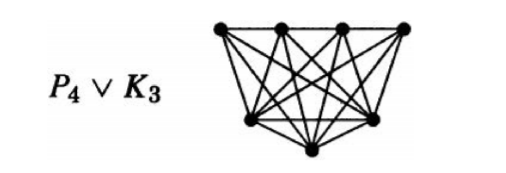
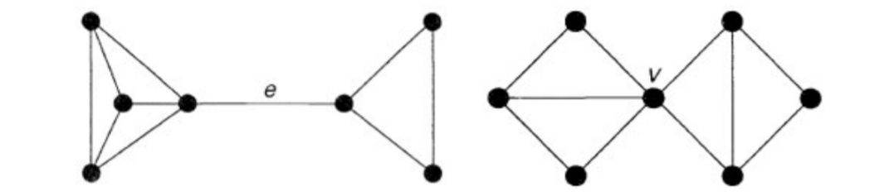

## Paths and cycles

### Cycle

Let $G$ be a graph in which all vertices have degree at least two, then $G$ contains a cycle.

### Connected

A graph is connected if, for each pair $x,y$ of vertices, there is a path from $x$ to $y$; the number of component is denoted by $ω(G)$.

### Join

The **join** of simple graphs $G$ and $H$, written $G∨H$, is graph obtained from the disjoint union $G+H$ bu adding the edges ${xy:x∈V(G),y∈Y(H)}$.

### Wheel graph

The **wheel** graph $W_n$ is $K_1∨C_{n-1}$.

### Distance

The **distance** from $u$ to $v$, written $d(u, v)$, is the length of a shortest path from $u$ to $v$.

### Eccentricity（离心率）

The **eccentricity** $ε(x)$ of $x$ is the largest value of $d(x, y)$, where $y$ ranges through all the vertices.

### Diameter and radius

The **diameter** $D = D(G)$ of $G$ is the maximum value of $ε(x)$ for all vertices $x$ of $G$, while the **radius** $R = R(G)$ is the smallest value of $ε(x)$.

### Grith（围长） and circumference（周长）

The **girth** $g(G)$ of a graph $G$ is the length of the shortest cycle contained in $G$; the **circumference** $c(G)$ of $G$ is the length of the longest cycle on $G$.

### Bipartite graph

A graph $G$ is bipartite graph if and only if it has no odd cycles（奇长圈）.

### Component(连通分支)

Let $G$ be a simple graph on $n$ vertices. If G has $k$ components, then the number $m$ of edges of $G$ satisfies $n − k ≤ m ≤ (n − k)(n − k + 1)/2$.

Any simple graph with $n$ vertices and more than $(n − 1)(n − 2)/2$ edges is connected.

### Edge-connectivity

A **disconnecting set** in a connected graph $G$ is a set of edges whose removal disconnects $G$.

An **edge cut (cutset)** is a disconnecting set, no proper subset of which is a disconnecting set( minimal disconnecting set ).

If an edge cut has only one edge $e$, we call $e$ a **cut edge** or **bridge**.

**Remark.** Given $S, T ⊆ V(G)$, we write $[S, T]$ for the set of edges having one endpoint in $S$ and the other in $T$. An edge cut is an edge set of the form $[S, \bar{S}]$ , where $S$ is a nonempty proper subset of $V(G)$ and $\bar{S} = V(G) − S$.

If $G$ is connected, its **edge connectivity** $λ(G)$ is the size of the smallest edge cut in $G$. Thus $λ(G)$ is the minimum number of edges that we need to delete in order to disconnect $G$.

$G$ is **$k$-edge connected** if $λ(G) ≥ k$. Equivalently, a graph is $k$-edge-connected if every disconnecting set has at least $k$ edges.

If $λ(G) = k$, then $G$ is $k$-edge connected, but not $k+1$-edge connected.

### Connectivity

A **separating set** (or **vertex cut**) in a connected graph $G$ is a set of vertices whose deletion disconnects $G$. If a separating set contains only one vertex $v$, we call $v$ a **cut vertex**.

If $G$ is connected (**not a complete graph**), its (vertex) **connectivity** $κ(G)$ is the size of the smallest separating set in $G$. Thus $κ(G)$ is the minimum number of vertices that we need to delete in order to disconnect $G$.

$G$ is **$k$-connected** if $κ(G) ≥ k$. If $κ(G) = k$, then $G$ is $k$-connected, but not $k+1$-connected.

$κ(K_n)=n-1$

$1$-edge connected = $1$-connected = connected

### Whitnry Theorem

If $G$ is a simple graph,then $κ(G) ≤ λ(G) ≤ δ(G)$（最小度）. 

**Proof.**$κ(G) ≤ |T| ≤ |[S,\bar{S}]| = λ(G) ≤ δ(G)$

### Characterization of 2-connected graphs

Two paths from $u$ to $v$ are **internally disjoint** if they have no common internal vertex.

A graph $G$ having at least three vertices is 2-connected if and only if for each pair $u, v ∈ V(G)$, there exist two internally disjoint $u, v$-paths in $G$.

A graph $G$ having at least $k + 1$ vertices is $k$-connected if and only if for each pair $u, v ∈ V(G)$, there exist $k$ internally disjoint $u, v$-paths in $G$.

A graph $G$ is $k$-edge-connected if and only if for each pair $u, v ∈ V(G)$, there exist $k$ edge disjoint $u, v$-paths in $G$.

### Eluerian Trail

A trail that traverses every edge of a graph is called an **Eulerian trail**. An **Eulerian circuit** is a closed Eulerian trail.

### Eluerian Graph

A graph which contains an Eulerian circuit is called an **Eulerian graph**. A graph which is not Eulerian, but contains an Eulerian trail is called a **semi-Eulerian graph**.

A **connected** graph G is **Eulerian** if and only if the degree of each vertex of $G$ is even.

A connected graph is Eulerian if and only if its set of edges can be split up into disjoint cycles.

A connected graph is semi-Eulerian if and only if it has exactly two vertices of odd degree.

### Fleury’s algorithm

Let $G$ be an Eulerian graph. Then the following construction is alwayspossible, and produces an Eulerian trail of $G$.

Start at any vertex $u$ and traverse the edges in an arbitrary manner, subject only to the following rules:

- erase the edges as they are traversed, and if any isolated vertices result, erase them too;
- at each stage, use a bridge only if there is no alternative.

### Hamiltonian graphs

A Hamiltonian cycle of $G$ is a cycle containing every vertex of $G$.

A graph is Hamiltonian if it contains a Hamilton cycle.

- $K_n$ is Hamiltonian for all $n ≥ 3$.
- $K_{m,n}$ is Hamiltonian if and only if $m = n ≥ 2$.

If $G$ and $H$ are Hamiltonian, then $G□H$ is Hamiltonian.

Let $S$ be a proper nonempty set of vertices of a Hamiltonian graph $G$.Then $ω(G − S) ≤ |S|$.(Necessity)

If $G$ is a simple graph with $n(≥ 3)$ vertices, and if $deg(v) + deg(w) ≥ n$ for each pair of non-adjacent vertices $v$ and $w$, then $G$ is Hamiltonian.

If $G$ is a simple graph with $n(≥ 3)$ vertices, and if $deg(v) ≥ \frac{n}{2}$ for each vertex $v$, then $G$ is Hamiltonian.

### Dijkstra algorithm

### The Chinese postman problem, Mei-Ku Kwan, 1960

A postman wishes to deliver his letters, covering the least possible total distance and returning to his starting point. He must obviously traverse each road in his route at least once .

The $G^∗$ has the minimum weight Eulerian circuit if and only if:
- Each edge of $G$ can be added to $G^∗$ at most once;
- For every cycle C of $G^∗$, $\displaystyle\sum^{}_{e \in {E_1 \cap E(C)}}w(e) ≤ \displaystyle\sum^{}_{e \in {E_1 \setminus E(C)}}w(e)$.