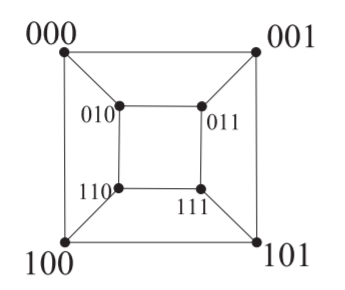

# Graph Theory

## Definitions and Examples of Graph Theory

### Graph

A graph G consists of a finite set V of vertices and a collection E of pairs of vertices called edges. We denote the set of vertices of $G$ by $V(G)$ and $E(G)$ the set of edges of $G$.

Note that we say $E$ is a collection of pairs, not a set of pairs. This is to allow repeated edges.

### multiple edges

If two or more edges joining the same two vertices, they are called multiple edges.

### adjacent and incident（相邻与关联）

If an edge e joins vertices $u$ and $v$ then we say $u$ and $v$ are adjacent or neighbors, written $u ↔ v$, and $e$ is incident with both $u$ and $v$; $u$ and $v$ are called the ends of $e$.

### loop

An edge with identical ends is called a loop.

### simple graph

A graph is simple if it has no loops or multiple edges.

### degree

Given a graph $G$, the number of edges incident with a vertex $v$, with loops counted twice, is called the degree of $v$ and is denoted by $d(v)$ .

- ∆(G)=$max{d(v)|v ∈ V(G)}$ is called the maximum degree of $G$;

- δ(G)=$min{d(v)|v ∈ V(G)}$ is called the minimum degree of $G$.

- neighborhood $N(v)$ : the set of all neighbors of $v$.

- degree sequence : the degrees written in increasing (or decreasing) order.

### isolated and pendant（悬挂点)

Vertices of degree 0 are called isolated vertices or singletons; Vertices of degree 1 are called pendant or end vertices.

### The first Theorem of Graph Theory

The sum of the degrees of the vertices of a graph is twice the number of edges.

$\displaystyle \sum^{}_{v∈V}{d(v)}=2|E|$

### subgraph

A graph H is called a subgraph of a graph $G$, written $H ⊆ G$, if $V(H) ⊆ V(G)$ and $E(H) ⊆ E(G)$.

- proper subgraph（真子图）

- spanning subgraph（生成子图）: $V(H) = V(G)$.

- A subgraph $F$ of a graph $G$ is called an induced subgraph（扫描子图） of $G$ if whenever $u$ and $v$ are vertices of $F$ and $uv$ is an edge of $G$, then $uv$ is an edge of $F$ as well. The subgraph of $G$ induced by $S$, $∅ ≠ S ⊆ V(G)$, is denoted by $G[S]$.

### isomorphism（同构）

Two graphs $G1$ and $G2$ are isomorphic (have the same structure) if there exists a one-to-one correspondence ϕ from $V(G1)$ to $V(G2)$ such that $u1v1 ∈ E(G1)$ if and only if $ϕ(u1)ϕ(u2) ∈ E(G2)$, written $G1 ∼= G2$.

In this case, $ϕ$ is called an isomorphism from $G1$ to $G2$.

If two graphs $G$ and $H$ are not isomorphic, then they are called nonisomorphic graphs and we write $G ∼≠ H$.

### isomorphism–continued

- Isomorphism of unlabelled graph : it is fair to say that “How many isomorphism classes of graphs with n vertices are there?”

- Isomorphism of labeled graphs : it is fair to say that the number of graphs on a fixed set of n vertices. That is, a labeled isomorphism is a vertex bijection which is both edge-preserving and label-preserving.

### connectedness（连通性）

- the union of $G1 = (V1, E1)$ and $G2 = (V2, E2)$. $G1 ∪ G2$ is the graph with vertex set $V1 ∪ V2$ and edge family $E1 ∪ E2$.

- A graph is connected if it cannot be expressed as the union of two graphs, and disconnected otherwise.

- Any disconnected graph G can be expressed as the union of connected graphs, each of which is a component of G. The number of components of G is denoted by $ω(G)$.

### graph operations

- $G − v$;

- $G − S$, the graph obtained by deleting the vertices in $S$ and all edges incident with any of them.

- $G − e$;

- $G − F$, while $F ⊂ E(G)$.

- $G \ e$ : contraction（收缩）, the graph obtained by taking an edge $e$ and
contracting it – removing it and identifying its ends $v$ and $w$ so that the
resulting vertex is incident with those edges (other than $e$) that were
originally incident with $v$ or $w$.

### graph expression

- set: $V(G)+E(G)$

- graph

- matrix

    - adjacency matrix（邻接矩阵）（A）
        $$
            \begin{matrix}
               & v1 & v2 & v3 & v4 \\
            v1 & 2 & 1 & 0 & 1 \\
            v2 & 1 & 0 & 1 & 2 \\
            v3 & 0 & 1 & 0 & 1 \\
            v4 & 1 & 2 & 1 & 0 \\
            \end{matrix}
        $$

    - incidence matrix（关联矩阵）（B）

        $$
            \begin{matrix}
               & e1 & e2 & e3 & e4 & e5 & e6 & e7 \\
            v1 & 1 & 0 & 0 & 1 & 0 & 0 & 2 \\
            v2 & 1 & 1 & 0 & 0 & 1 & 1 & 0 \\
            v3 & 0 & 1 & 1 & 0 & 0 & 0 & 0 \\
            v4 & 0 & 0 & 1 & 1 & 1 & 1 & 0 \\
            \end{matrix}
        $$

### Laplacian matrix

Given a simple graph $G$ with n vertices, its Laplacian matrix $L$ is defined as: $L = D − A$ , where $D$ is the degree matrix (a diagonal matrix with diagonal elements being degree of its corresponding vertex) and $A$ is the adjacency matrix of $G$.

Generally, all eigenvalues of $L(G)$ are called the Laplacian eigenvalues of $G$ and arranged in nonincreasing order:

$λ1 ≥ · · · ≥ λn−1 ≥ λn$

- $λn−1$ is positive if and only if $G$ is connected. Thus, $λn−1$ is called algebraic connectivity (or Fiedler value);

- The number of connected components in $G$ is the dimension of the nullspace of the Laplacian matrix.

Laplacian matrix has lots of applications in machine learning, complex network, control theory, physics.

### empty graph

A graph whose edge-set is empty is a empty graph . We denote the empty graph on $n$ vertices by $E_n$.

### complete graph

A simple graph in which each pair of distinct vertices are adjacent is a complete graph $K_n$.

### regular graph(正则图)

If $δ(G) = ∆(G)$, then the vertices of $G$ have the same degree and G is called regular . If $deg(v) = r$ for every vertex $v$ of $G$, where $0 ≤ r ≤ n − 1$, then $G$ is $r$- regular or regular of degree $r$.

A 3-regular graph is also referred to as a cubic graph.

### Petersen graph

The simple graph whose vertices are the 2-element subsets of a 5-element set and whose edges are the pairs of disjoint 2-element subsets.

### 柏拉图图（Platonic graph）

### Bipartite graph（二部图）

If the vertex set of a graph $G$ can be split into two disjoint sets $A$ and $B$ so that each edge of $G$ joins a vertex of $A$ and a vertex of $B$, then $G$ is a bipartite graph.

A complete bipartite graph is a bipartite graph in which each vertex in $A$ is joined to each vertex in $B$ by just one edge. We denote the bipartite graph with $r$ black vertices and s white vertices by $K_{r,s}$.

### Cartesian product（卡氏乘积）

The cartesian product of $G$ and $H$, written $G□H$, is the graph with vertex
set $V(G) × V(H)$ specified by putting $(u, v)$ adjacent to $(u^`,v^`)$ if and only if:
(l) $u = u^`$ and $vv^` ∈ E(H)$, or (2) $v = v^`$ and $uu^` ∈ E(G)$.

### Hypercube/k-cube（超立方/k立方）

The k-cube (or hypercube) $Q_k$ is the graph whose vertices correspond to the sequences $(al, a2, · · · , ak)$, where each $a_i = 0$ or $1$, and whose edges join
those sequences that differ in just one coordinate.

$Q_k = Q_{k-1} □ K_2$ （复制，对应顶点相连）

### Complement（补图）

If $G$ is a simple graph with vertex set $V(G)$, its complement $\bar{G}$ is the simple graph with vertex set $V(G)$ in which two vertices are adjacent if and only if they are not adjacent in $G$.