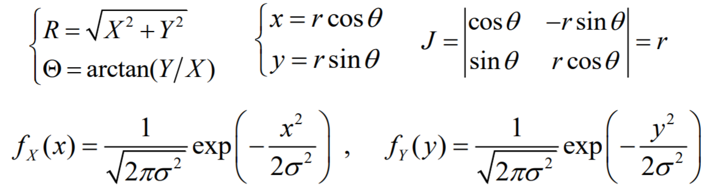
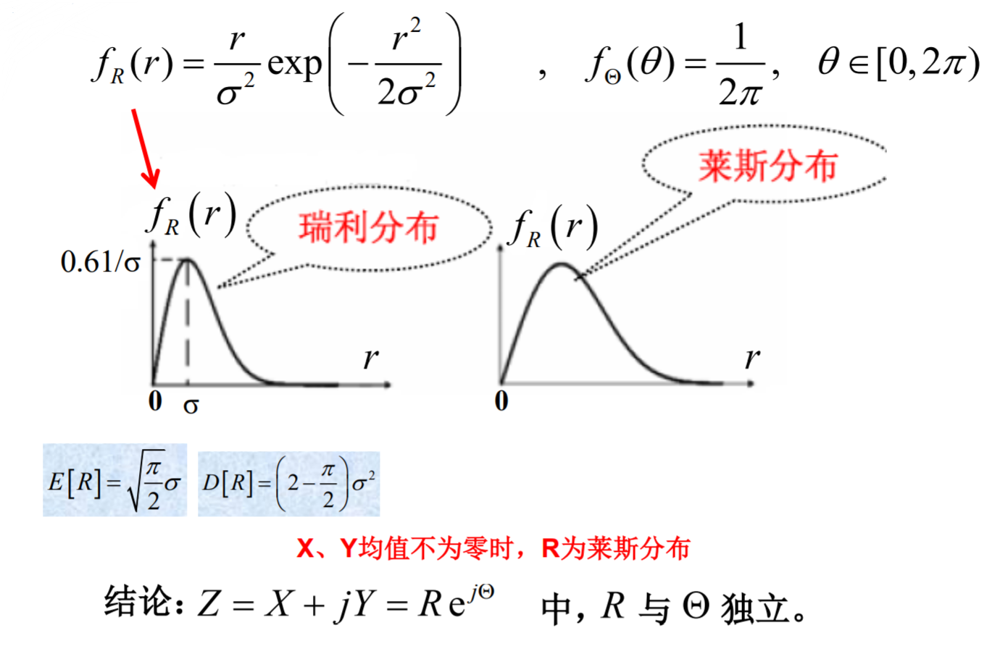
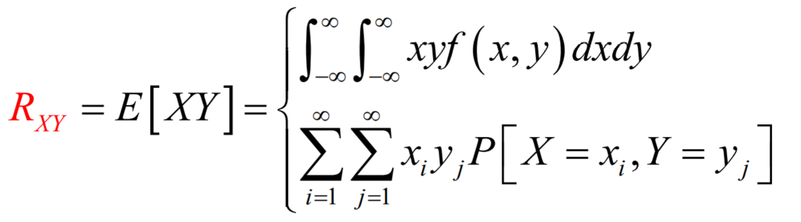

### 瑞利与莱斯分布

复随机变量$Z = X + jY = Re^{jΘ}$，其实部与虚部独立，且$X-N(0,σ^2)$，$Y-N(0,σ^2)$，讨论振幅R与相位Θ的概率特性。

### 数字特征与条件数学期望

### 矩和联合矩

||k阶矩|k+r阶联合矩|
|---|---|---|
|原点矩|$m_k=E(X^k)$|$m_{k+r}=E(X^kY^r)$|
|中心矩|$μ_k=E(X-EX)^k$|$μ_{k+r}=E[(X-EX)^k(Y-EY)^r]$|

### 均方值

$E(X^2)$

### 方差

$D(X)=E[(X-EX)^2]=E[X^2]-E^2[X]$

### 标准差

$σ_x=\sqrt{D[X]}$

### 联合矩

### 协方差

$C_{XY}=Cov[X,Y]=E[(X-EX)(Y-EY)]$
$C_{XY}=E[XY]-E[X]E[Y]=R_{XY}-m_xm_y$

### 相关系数

$ρ_{XY}={Cov[X,Y]\over{σ_xσ_y}},|ρ_{XY}≤1|$

### $R_{XY}$ , $C_{XY}$ , $ρ_{XY}$的关系

同：三者都用于表示$X、Y$的关联程度

异：

- $R_{XY}=E[XY]$，包含均值、方差对关联程度的影响。

- $C_{XY}=E[(X-m_X)(Y-m_Y)]$，包含离散程度对关联程度的影响

- $ρ_{XY}={Cov[X,Y]\over{σ_xσ_y}}$，消除了均值、方差对关联程度的影响，因而单纯地反映了$X、Y$的相关性

### 独立、不相关、正交的关系

- （线性）无关

    $Cov[X,Y]=0$或$ρ_{XY}=0$ , $E(XY)=(EX)(EY)$

- 正交

    $E(XY)=0$

- 独立

    $P(X=x,Y=y)=P(X=x)O(Y=y)$
    或 $F(x,y)=F(x)F(y)$
    或 $f(x,y)=f(x)f(y)$