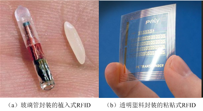

# 物联网感知层技术

感知识别技术融合物理世界和信息世界，是物联网区别于其它网络最独特的部分。

## 感知层的基本概念

### 感知层在物联网中的重要性

感知层是物联网的基础，是联系物理世界与信息世界的纽带。

将物联网中能自动感知外部物体与物理环境信息的设备，如：传感器、RFID芯片、GPS终端设备、智能家电等设备抽象为**“智能物体”（“感知节点”或“感知设备”）**。

感知层由大量具有感知、通信、识别（或执行）能力的智能物体与感知网络组成，感知数据的准确性与实时性决定了物联网的应用价值，感知节点的分布范围决定了物联网的覆盖能力，感知节点的生存能力决定了物联网的生命周期。

### 感知节点的特点

不同的物联网应用系统感知节点的差异很大，感知节点可以是小物体也可以是大建筑，可以是固定的，也可以是移动的，可以是有生命的，也可以是无生命的。

感知节点的感知能力与控制能力：能够让物体“开口”的技术。作为具有智能处理能力的传感器节点，必须同时具备感知和**控制能力**，从RFID标签芯片、温度传感器到智能机器人，它们之间**最重要的区别**：是否具备感知能力和控制、执行能力。

## RFID与自动识别技术的发展

### 自动识别技术的发展

在生产、销售全球化的背景下，数据的快速采集与自动识别成为销售、仓库、物流、交通、防伪与身份识别领域发展的瓶颈基于**条形码、磁卡、IC卡、RFID**的数据采集与自动识别技术的研究就是在这样的背景下产生并发展的

### 条码

条形码是将宽度不等的多个黑条（或黑块）和空白，按照一定的编码规则排列，以表达一组信息的图形标识符。目前最常见的是一维条形码，信息量约几十字符，二维条形码相对复杂，信息量可达几千字符，其优点是使用方便快捷、设备成本低廉。

#### 一维条形码的特点

一维条形码只在一个方向（水平方向）表达信息

一般由黑条（块）和白条（空）排成的图案

优点：编码规则简单，条形码识读器造价较低

缺点：数据容量小，只能含字母和数字，条码尺寸较大，空间利用率较低，一旦出现损坏将被拒读

#### 二维条形码的特点

利用某种特定的几何图形按一定规律在平面上（水平和垂直方向）分布的黑白相间图形记录数据符号信息

|一维条形码|二维条形码|
|---|---|
|编码简单，识读器造价较低||
|可显示英文、数字、简单符号|可显示英文、中文、数字、符号、图型|
|贮存数据量较小|贮存数据量大，可存放1kB信息|
|保密性不高|保密性高（可加密）|
|损污后可读性差|损污50%仍可读取完整信息|

### 智能卡

IC卡（Integrated Circuit Card），即集成电路卡，通过在集成电路芯片中写有数据来进行识别的

**标准IC卡系统**包括：IC卡、IC卡接口设备（读写器）、PC较大的系统还包括网络和主计算机等

#### IC卡的种类（按功能)

##### 存储器卡

无安全加密，可对片内信息进行任意存取，卡片制造中也很少采取安全保护措施（身份证、就诊卡）

##### 逻辑加密卡

由非易失性存储器和硬件加密逻辑构成，安全性能较好，芯片制造采取较好的安全保护措施（IC电话卡、公交卡）

##### CPU卡

计算能力高，存储容量大，安全防伪能力强，可验证卡和持卡人的合法性，且可鉴别读写终端（银行卡）

### RFID标签

**射频识别**（RFID：Radio Frequency Identification）利用射频信号通过空间耦合（交变磁场或电磁场）实现无接触信息传递并达到识别目的。

RFID技术能实现全球范围的各种产品、物资流动过程中的动态、快速、准确识别与管理，它在上世纪90年代兴起，首先在欧洲使用，随后在全世界普及，其优点是电子标签和阅读器无需接触便可完成识别，小型化、高性能、低价格。

#### 发展历程

|年代|事件|
|---|---|
|1941-1950|雷达技术催生了RFID技术，1948年奠定了RFID技术的理论基础|
|1951-1960|早期RFID技术的探索阶段，仍处于实验室实验研究|
|1961-1970|RFID技术的理论得到进一步发展，人们开始尝试一些新应用|
|1971-1980|RFID技术及产品研发处于高潮期，各种RFID技术测试得到加速，出现了最早的商业应用|
|1981-1990|RFID技术及产品进入商业应用阶段，各种规模应用开始出现|
|1991-2000|RFID技术标准化问题日趋得到重视，RFID应用更加丰富，已经成为人们生活的一部分|
|2000至今|RFID产品种类更加丰富，各类标签得到大发展，标签的成本也不断降低，规模应用行业开始扩张|

#### RFID的基本结构

#### RFID基本工作原理

RFID系统由五个组件构成：传送器、接收器、微处理器、天线、标签，传送器、接收器和微处理器通常封装在一起，统称为阅读器（Reader），所以常将RFID系统分为阅读器、天线和标签三大组件。

类似于雷达，阅读器通过天线发出信号，标签收到信号后发回内部存储标识信息，阅读器再通过天线接收并识别标签发回信息，最后阅读器将识别结果发至主机。

##### 阅读器
    
阅读器是RFID系统中最重要、最复杂的一个组件。因其主动向标签询问标识信息，又称为询问器

阅读器通过网口、串口或USB口同主机相连（数据输出）
    
通过天线同RFID标签通信（信号发送与接收）

阅读器、天线、智能终端集成在一起形成移动手持阅读器

##### 天线
天线同阅读器相连，用于标签和阅读器间传递射频信号
    
阅读器可以连接一个或多个天线，但每次使用时只能激活一个天线
    
RFID系统的工作频率从低频到微波，这使天线与标签芯片之间的匹配问题变得很复杂

##### 标签（Tag）

由耦合元件、芯片及微型天线组成，每个标签内部存有唯一的电子编码，附着物体上，用来标识目标对象

#### RFID标签的优势

体积小且形状多样：读取不受尺寸与形状限制

耐环境性：RFID对水、油等物质有极强的抗污性。即使在黑暗的环境中，RFID标签也能够被读取

可重复使用：标签具有读写功能，数据可反复覆盖

穿透性强：标签在被纸、木材、塑料等材质包裹情况下也可进行穿透性通信

数据安全性：标签内的数据通过循环冗余校验的方法来保证标签发送的数据准确性

#### RFID标签分类及其工作原理

##### 被动式标签（Passive Tag）

标签内部无电源，也被称为“无源标签”

标签接近读写器时，标签处于读写器天线辐射形成的近场范围内
    
标签通过电磁感应产生感应电流，感应电流驱动芯片电路
    
工作过程：读写器向标签传递能量，标签向读写器发送标签信息
    
读写器与标签之间能够双向通信的距离称为“可读范围”或“作用范围”
    
体积小、重量轻、价格低、使用寿命长，但通信距离较短

##### 主动式标签（Active Tag）

内部携带电源，也被称为“有源标签”

体积较大、价格昂贵。但通信距离更远，可达上百米
    
处于远场的有源标签由内部配置的电池供电
    
从节约能源、延长标签工作寿命的角度，有源标签可以不主动发送信息
    
当有源标签接收到读写器发送的读写指令时，标签才向读写器发送存储的标识信息
    
工作过程：读写器向标签发送读写指令，标签向读写器发送信息的过程

##### 半主动式标签（Semi-active Tag）

兼有被动标签和主动标签的优点
    
携带电池，为内部计算提供电源（读写器未访问时，只为芯片内很少的电路提供电源）
    
在读写器访问时，内置电池向RFID芯片供电，以增加标签的读写距离，读写距离较远，提高通信可靠性
    
半主动式RFID标签一般用在可重复使用的集装箱和物品跟踪领域

##### 低频（LF）：30 kHz~300 kHz（125 kHz与133 kHz）

低频标签一般都为无源标签，通信距离一般小于1米。除金属材料外，低频信号能够穿过任意材料而不降低读取距离（门禁系统）

##### 中高频（HF）：3 MHz~30 MHz（13.56 MHz与27.12 MHz）

具有防碰撞特性，通信距离一般小于1米，可穿过任意材料，但会降低读取距离（二代身份证、物流）

##### 超高频与微波：300 MHz~300 GHz

RFID典型工作频率：860 MHz~928 MHz，2.45 GHz~5.8 GHz

分为有源标签与无源标签两种。通信距离一般大于1米，典型距离为4~7米，最大可超过100米

视距传输，绕射能力差

用于无遮挡的远距离识别及近距离快速移动物体识别

#### RFID标签编码标准

在RFID系统中，要能够准确记录每件物体的具体信息就必须形成全球统一的、标准的、唯一能够准确标识各国、各企业生产的各个产品的电子编码标准

RFID广泛应用的基础：RFID标签编码的标准化与RFID标签体系的建立

目前最有影响的标准主要有：EPC Global RFID标准、UID RFID标准、ISO/IEC RFID标准

## 传感器与无线传感器网络

### 传感器的基本概念

**传感技术**作为信息获取的重要手段，与**通信技术**和**计算机技术**共同构成信息技术的三大支柱

传感器是物联网感知层的重要器件，是物联网及时、准确获取外部物理世界信息的重要手段

**传感器国标**（GB7665-2005）：能**感受被测量**并按一定规律转换成可用输出信号的器件或装置

**传感器**：由敏感元件和转换元件组成的检测装置，**能感受到被测量**，并能将检测和感受到的信息，按一定规律变换成为电信号（电压/电流/频率/相位）输出

传感器最早出现于1861年，应用于工农业、医疗卫生、军事国防、环保等多个领域，实现**温湿度的感知与控制功能，智能程度有限**。

#### 现代传感器

微型化、智能化、无线通信和网络化

典型代表：无线传感器节点/网络

#### 无线传感节点

电池、传感器、微处理器、无线通信芯片

#### 传感器的分类

### 智能传感器的研究与发展

传感器技术的发展：智能与无线

#### 智能传感器的特点

将传感器与微处理器集成为一体，使其具有环境感知、数据处理、智能控制与数据通信功能

##### 自学习、自诊断与自补偿能力
  
数据预处理、调整工作模式以适应环境、补偿温度漂移、自我修复、数据保护、故障报警

##### 复合感知能力

集成多种功能的传感器，全面进行感知

##### 灵活的通信能力

适用于各种规模网络的标准接口，具备自组网能力

#### 无线分组网的研究

1972年，美国军方开展军用无线分组网（PRNET）的研究，目标是如何将分组交换与无线技术相结合，组成能够在战场环境中应用的新型通信网络

无线自组网为一种特殊的自组织、对等式、多跳、无线移动网络（MANET）

#### Ad hoc网络的特点

自组织与独立组网：无需无线通信基础设施，所有节点通过分层协议体系与分布式算法自行协调工作状态，节点可独立、迅速的组网

无中心：对等网络，所有节点地位平等，节点间完全独立

多跳路由：节点覆盖功率有限，远距传输需经多跳节点

动态拓扑：节点间通信关系不断变化，节点可移动

无线传输的局限与节点能量的限制性：对整体尺寸与能耗方面要求较高

网络生存时间的限制：临时组网，生存时间短暂

#### 无线传感器网络

#### 制约因素

功耗制约：无线传感节点一般部署在野外，不能通过电线供电。其硬件设计必须以节能为主要目标

价格制约：无线传感节点一般需要大量组网，以完成特定的功能。其硬件设计必须以廉价为主要目标 

体积制约：无线传感节点一般需要容易携带，易于部署其硬件设计必须以微型化为主要目标

#### LWIM与WINS无线传感器网络的研究

**LWIM III型**：将传感器、控制电路与电源电路集成为一体

**WINS**：32位微处理器Strong ARM、1 MB内存与4 MB闪存、数据传输速率100 kbps，工作功耗200 mW，睡眠功耗0.8 mW

#### Smart Dust项目的研究

目标：通过MEMS技术，实现传感、计算与通信能力的集成

1998年：WeC，8位、主频4 MHz微处理器，内存512 B，闪存8 kB，数据传输速率10 kbps，工作功耗15mW，睡眠功耗45 μW

2001~2003年：Mica系列，8位、主频7.37 MHz微处理器

2004年：Telos，16位、主频4 MHz微处理器，内存2 kB，闪存60 kB，数据传输速率250 kbps，工作功耗3 mW，睡眠功耗6 μW

#### 无线传感器网络特点

##### 网络规模

表现为覆盖范围与节点数量两个方面

单位面积的传感器数量决定了传感精度

##### 自组织网络
    
传感器节点随机铺设，须具备自组网功能

##### 拓扑结构的动态变化

传感器节点体积微小、电能有限、CPU能力弱、存储容量小
    
需具备数据采集、转换、管理、处理、传输等多种任务
    
节点动态变化较大

##### 以数据为中心

重结果轻过程    

#### 无线传感器网络节点设计原则

##### 微型化与低成本

低成本节点才能被大规模部署
    
微型化节点才能使部署更加容易

典型例子：医用传感器Mercury

- 传感器设计人性化 
- 传感器具有高精度感知能力
- 传感器能连续长期采集数据
- 传感器使用无线通信方式

##### 低功耗

###### 在硬件设计上采用低功耗芯片

Telos B节点使用的微处理器，在正常工作状态下功率为3 mW，而计算机功率通常为200W~300 W 

###### 软件策略实现节能 
原理：尽量使节点在不需要工作时进入低功耗（Idle）模式，仅在需要工作时进入正常状态

例：手机待机模式、计算机休眠状态
        
核心问题：工作→休眠→工作，待机功耗？

##### 灵活性与扩展性

传感器节点应用于各种不同场合，因此硬件和软件的设计必须具有灵活性和扩展性
    
硬件设计需满足一定标准的接口，例如节点和传感板的接口统一，有利于给节点安装上不同功能的传感器 
    
软件设计必须是可剪裁的，能够根据不同应用的需求，安装不同功能的软件模块

##### 鲁棒性（Robust—健壮性）

鲁棒性：实现传感器网络长时间部署的重要保障 
    
传感器网络中，适当增加部分器件/保护电路（冗余性），以提高系统鲁棒性  

#### 无线传感器节点设计方法

##### 能量供应

电池供电，节点易部署。多用可再生能源，如太阳能

##### 通信芯片

在无线传感节点的能量消耗中，通信芯片消耗能量最多,例如在Telos B中，CPU工作电流500 μA，通信芯片工作电流20 mA 

通信芯片发送和接收状态时消耗能量差别不大，只要通信芯片处于工作状态，能量消耗都差不多
    
通信芯片传输距离是选择节点的重要指标。发射功率越大，接收灵敏度越高，信号传输距离越远

##### 传感器

有许多传感器可供节点平台使用，使用哪种传感器往往由具体应用需求及传感器本身特点决定
    
根据处理器与传感器交互方式：通过模拟或数字信号，选择是否需要外部模数转换器和额外的校准技术

##### 微处理器
    
微处理器是无线传感节点中负责计算的核心 
    
集成了内存、闪存、模数转化器、数字I/O等
    
各个部件的关键性能

###### 功耗特性（降低休眠电流）

决定无线传感器网络的生命周期，休眠电流典型值1~50 μA，如电池容量2000 mAh，工作时间4.5年~228.3年        

###### 唤醒时间（休眠/工作状态间快速切换）

切换越快，平均功耗越小，典型值6 μs~10 ms

###### 供电电压（长时间工作）

电压范围越大，平均功耗越小，典型值1.8 V~3 V

###### 运算速度

提高或降低CPU主频，对功耗影响很小

###### 内存与闪存大小（内存大、闪存小）

数据存于内存（易失）中，程序代码存于闪存（非易失）中

###### 操作系统

无线传感器网络大多使用TinyOS

简单、微型化的操作系统，消耗极低的内存资源（约1 kB）

###### 发展趋势

软硬件高度相关，同时发展

硬件：低价格、小体积、功耗低、更强计算能力

软件：微型化、简单化、灵活可重构

## 位置信息感知技术

### 基本概念

确定智能物体的地理位置，利用地理信息系统（GIS）与移动通信技术，向智能物体提供与其位置相关的信息服务

#### 基于位置的服务

自动导航

搜索周边服务信息

#### 位置信息

地理位置（空间坐标）

处在该位置的时刻（时间坐标）

处在该位置的对象（身份信息）

### GPS与定位技术

全球定位系统（GPS：Global Positioning System）是一种典型的卫星定位系统，也是世界上应用最广泛的定位导航系统

#### 各国的卫星定位系统

美国：GPS

俄罗斯：GLONASS（格洛纳斯）

欧盟：伽利略

中国：北斗一号（区域，2012）、北斗二号（全球，2020）

#### GPS

GPS分为空间部分、地面控制部分与用户终端

##### 宇宙空间部分

由位于6个轨道平台的24颗距地表高度为20200 km的卫星组成，其中21颗为工作卫星，其余3颗为备用卫星

###### 三点定位方式

一点确定一个球面，两点确定一个圆面，三点确定唯一交点，地平线上卫星数目最少为4颗，最多11颗。

###### 距离测定方式

GPS卫星发出连续不断的信号，由接收机接收这些信号，通过收发信号之间的时间差及电磁波的传输速率，计算距离。工作卫星搭载铯原子钟，保持时钟的精准。

##### 地面监控部分（美国境内）

1个主控中心（科罗拉多州）+1个备用中心（马里兰州）

4个专用地面天线，6个专用监视站

##### 用户设备部分

GPS接收机（手机，GPS导航仪等）

#### GPS的应用领域

陆地/海洋/航空航天：为船舶/汽车/飞机/行人进行定位导航

最初仅能提供位置和周边地图，第二代汽车导航系统可根据目的地自动计算“最短”路线，近年来，汽车导航还可优化路线，找出“最快”路线

#### GPS的特点

优点：精度高、全球覆盖、操作简便、可用于险恶环境

缺点：定位时间较长（3~5分钟）、室内信号差（电磁屏蔽、电磁反射）

#### 物联网时代的GPS

感知更透彻、路线可订制

综合道路状况，污染指数，天气状况，加油站的分布，驾驶员的自身情况等各种因素找出“最佳”路线

由“以路为本”转变到“以人为本”

### 其他定位方式

#### 蜂窝基站定位（移动终端定位）

##### 出现背景

GPS的致命短板—室内定位、移动终端用户对定位的需求

##### GSM蜂窝网络

通信区域被分割成蜂窝小区，每个小区对应一个基站，利用基站位置已知的条件，可对通信设备进行定位

###### 单基站定位法

将移动设备所属基站的位置视为移动设备的位置，精度直接取决于基站覆盖的范围（几十米~几十千米）以及用户与基站间的距离

简单、快速，适用紧急情况；误差过大，实质为一种区域定位。

###### 多基站定位法

- ToA（Time of Arrival）：类似于GPS定位，用基站代替卫星，但基站时钟精度低，且存在多径干扰，定位结果误差较大

- TDoA（Time  Difference of Arrival）：用信号到达不同基站的时间差建立方程组求出位置，可抵消大部分定位误差，但至少需要三个基站进行定位，某些区域无法使用

- AoA（Angle of Arrival）：已知定位目标与两个基站连线的方位，便可利用两条射线的交点确定目标位置，但需要配置昂贵的方向天线阵列

##### 基站定位的特点

###### 优点

- 不需要GPS接收机，通讯即可定位
- 定位速度快
- 信号穿透能力强，室内亦可接收到

###### 缺点

- 定位精度较低
- 基站需要有专门硬件，造价昂贵

#### 无线室内环境定位

室内环境更为复杂，会由各种障碍引发多径效应
   原因：障碍物反射电磁波，室内障碍物众多，大量反射波与原始波在接收端混叠，多径效应明显

电磁波阻碍：长波信号（GPS）传播能力强，但穿透力弱

##### 信号强度（RSS：Received Signal Strength）定位

使用信号强度在传输中的衰减特性进行定位

利用已有无线网络（蓝牙、Wi-Fi、ZigBee）、RFID等

与基站定位与GPS相比，RSS具有无需大规模专用网络、性价比高、使用方便等优势

#### 新型定位系统

##### A（Assisted）-GPS定位

GPS定位和蜂窝基站定位的结合

解决GPS定位速度过慢、基站定位误差过大的问题
 
- 利用基站定位确定大致范围
- 连接网络，查询当前位置可见卫星
- 缩短搜索卫星时间，定位时间几十秒，精度与GPS相同

##### 无线接入点（AP：Access Point）定位
基于Wi-Fi的无线网络定位，市区无线AP数目多，定位精确

#### 定位中的关键技术

有一个或多个已知的参考点（基站、卫星、无线AP点），得到待定位物体与已知参考点的空间关系

##### 定位技术两步骤

- 测量物理量
- 根据物理量确定目标位置

##### 常见定位技术

###### 基于距离的定位（ToA）

先测得目标到一个或数个参考点的距离，再利用测得距离及参
考点坐标计算目标位置

- 距离测量方法
参考点发出信号波（声波或电磁波），波速为$v$，发射时间为$t_0$，目标接收时间为$t$，则$d=v×Δt$（传播时间$Δt=t–t_0$）（波速差计算法、测量波的往返时间）
- 位置计算方法
测得一组距离后，利用多边（多点）测量法计算目标位置

###### 基于距离差的定位（TDoA）

ToA需要参考点和测量目标时钟同步，TDoA不需要参考点和测量目标时钟同步，参考点之间仍然需要时钟同步。

- 距离差的测量方法
测量目标向不同参考点广播信号，参考点$i，j$分别记录信号接收到的时刻$t_i，t_j$，测量目标到$i，j$的距离差
- 位置计算方法
利用参考点坐标$(x_i, y_i)，(x_j, y_j)$构建方程计算目标到参考点的距离差，至少两组数据联立方程组求解，实际采用多组数据。

###### 基于信号强度的定位（RSS）

ToA/TDoA都需要安装定位装置（信号发射与接收装置），基于信号特征的定位直接利用无线通信射频信号定位，无需额外设备

原理：信号强度随传播距离衰减（RSS）

问题：上式为理想公式，在实际中难以应用

解决方法:将信号强度看做“特征”，预先布置N个参考节点，测出区域中每个位置的信号强度特征向量（特征地图），将目标测出的特征向量和事先测量值进行比对，找出位置

缺点：精确度与特征地图测量精度紧密相关；可能会出现多个特征完全相同的位置；无法应对动态变化

    LANDMARC：基于信号特征的动态定位法
    除了信号发送源外，再布置一系列RFID标签作为参考标志，每个标签随时记录自身收到的RSS信号强度特征向量，将目标测得的信号特征向量与参考标志此时的特征向量进行比对，确定位置，误差范围在1 m以内

### 定位技术在物联网中面临的挑战

#### 网络异构

接入物联网的设备五花八门，连接网络各自不同，如何让不同设备在不同网络下实现精确定位（**兼容性**）

#### 环境多变

室外、室内，空旷地带、障碍物众多，静止设备、频繁运动，如何让定位设备在不同环境下实现精确定位（**适应性**）

#### 信息安全与隐私保护

位置信息内涵丰富且与个人隐私息息相关，高精度位置信息泄露的后果严重，如何既保证信息精度，又保护个人隐私（**安全性**）

#### 大规模应用

物联网时代，接入网络设备将超过500亿台，如何应对庞大的数量增长（**可扩展性**）

如何让定位技术为简单设备（如**RFID标签**）所用
