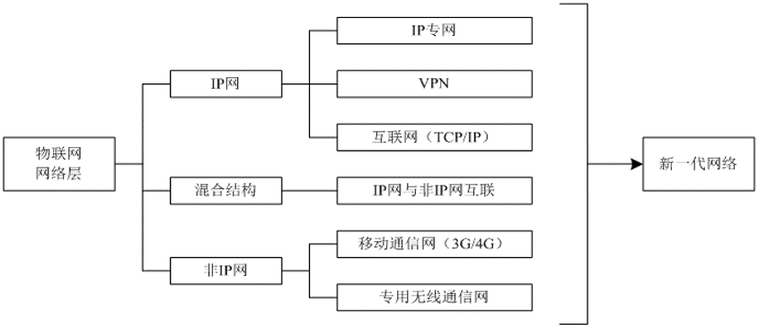
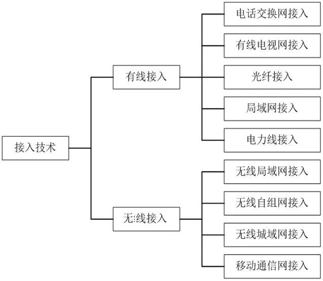
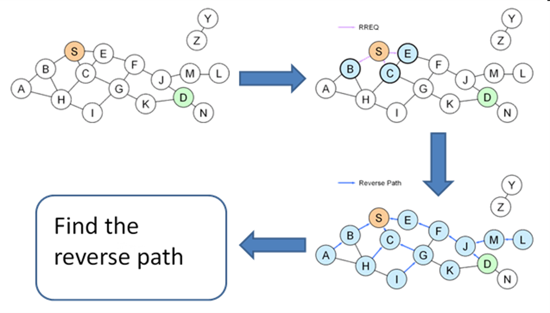
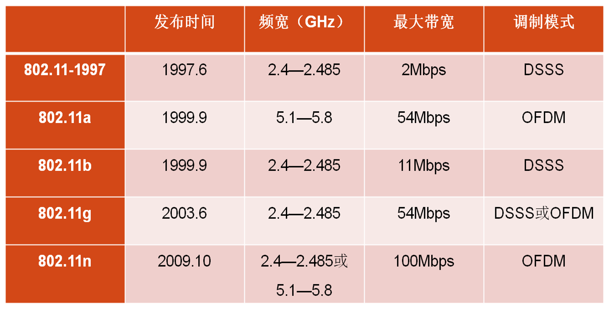
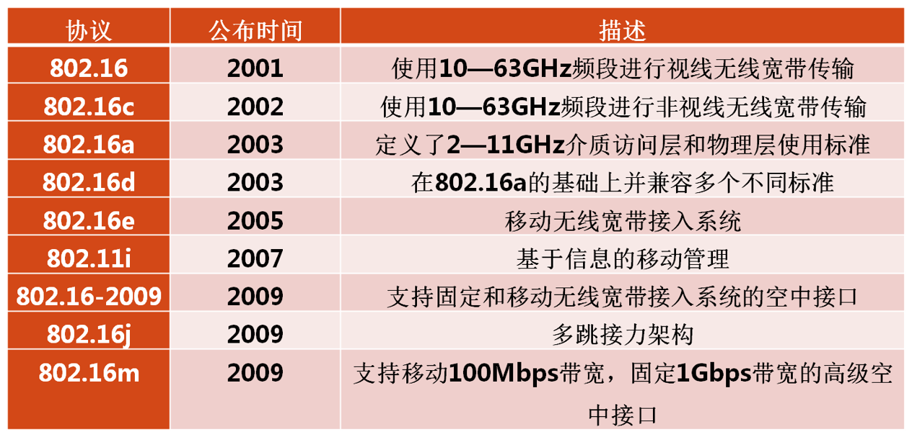
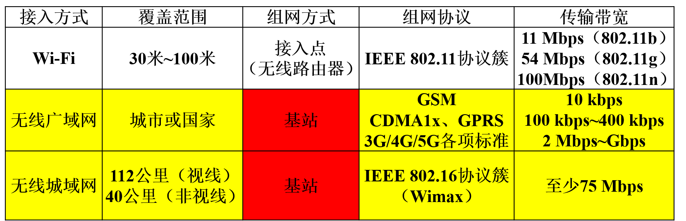
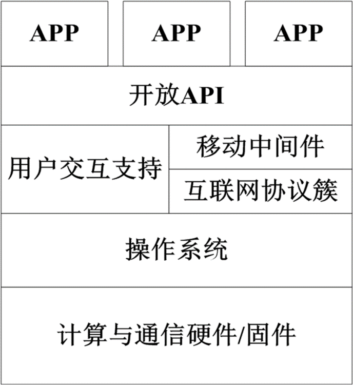
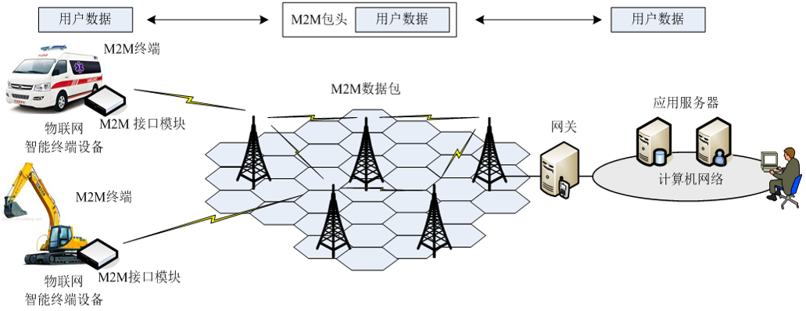

# 物联网网络层技术

互联网是物联网最重要的基础设施之一

## 物联网网络层概述

网络层：将分布各地的感知设备与计算机相连，并传输各类数据

### 基本功能

- 连接感知层与应用层
- 正确/快速/安全传输感知数据与控制指令

### 网络结构

**物联网网络层一般采用异构网络互联结构**

- 物联网的网络基础是互联网与移动互联网
- 感知数据采集/**传输**/存储/处理离不开计算机与计算机网络
- 随着移动通信网（3G/4G/5G）技术的发展，及移动电子商务的发展，物联网应用中常使用移动通信网技术
- **IP网（TCP/IP）到非IP网—网关完成不同协议间数据格式的转换**
- 采用异构网络互联结构是物联网网络层的重要特点

## 无线通信与接入

### 互联网、因特网、Internet

#### 计算机网络分类及拓扑结构

从传输技术角度—信道

- 广播式网络（Broadcast Network）
- 点到点网络（Point-to-Point Network）

从传输距离角度—尺度与范围

- 个人区域网（PAN）：10 m以内计算机、智能手机等终端设备
- 局域网（LAN）：覆盖10 m～10 km的网络
- 城域网（MAN）：覆盖10 km～100 km的网络
- 广域网（WAN）：覆盖100 km～1000 km的网络

##### 广域网（远程网）的主要特征

- 广域网作为核心主干网，是一种公共数据网络（提供电信级服务）
- 覆盖地理范围从几十公里到几千公里
- 可覆盖一个国家、地区，或横跨几个大洲，形成国际性远程计算机网络
- 通信子网：公用分组交换网、卫星通信网、无线分组交换网
- 用户通过主机终端访问本地与远程终端的计算机资源
- 研究重点：宽带核心交换技术

##### 宽带城域网的主要特征

- 完善的光纤传输网是宽带城域网的基础
- 传统电信、有线电视与IP业务融合成为宽带城域网核心业务
- 高端路由器和多层交换机是宽带城域网的核心设备
- 扩大宽带接入规模与提高服务质量是发展宽带城域网应用的关键

##### 局域网的主要特征

- 将有限范围内的各种计算机、终端与外部设备互联成网
- 可分为有线局域网（如以太网Ethernet）与无线局域网
- 覆盖如校园/工厂/写字楼等处的计算机、终端与各类信息处理设备联网的需求
- 提供高速（10 Mbps～100 Gbps）、低误码率的数据传输
- 用于办公室、个人计算机的接入；企业/学校主干网络；大型服务器集群、存储区域网络、云计算服务器集群后端网络

#### 物联网与下一代互联网

从互联网到物联网：延伸

下一代互联网：发展

下一代物联网的特点

- 规模更大：IPv6逐步取代IPv4，连接更多的终端和用户
- 速度更快：至少100 Mbps
- 使用更方便：与无线通信技术无缝配合，用户连接互联网不再受地理位置限制

### 接入网与物联网

#### 接入技术的分类

#### 无线接入技术

无线宽带网络与有线宽带网络区别在于**数据链路层和物理层**

- 无线通信由基站与上层网络进行数据交互
- 基站等价于交换机，无线网卡代替了有线网卡

##### 无线通信所面临的困难

- 信号强度衰减：无线信号能量随传输距离增长而大幅减弱
- 非视线传输：若发送者与接收者之间的路径部分被阻挡则无线信号可能会被阻挡物吸收或迅速衰减
- 信号干扰：相同频段信号以及外部电磁噪声会相互干扰
- 多径传播：无线信号由于阻挡物反射与折射，到达接收端时间不同
- 隐藏终端（Hidden Terminal）问题

#### 无线个域网（WPAN)

##### 蓝牙技术

- 由爱立信公司与IBM、英特尔、诺基亚与东芝4家公司发起
- 短距、低功耗、低成本
- 工作频率2.4 GHz
- 数据传输速率最高为24 Mbps
- 通信距离一般在10 cm～10 m
- 支持点对点、点对多点通信

##### ZigBee（紫蜂）

###### 基本概念

- 一种面向自动控制的低速、低功耗、低价格无线技术
- 用于数据采集与控制节点多、数据传输量不大、覆盖面广、造价低的场所
- 无线传感网领域最著名的通信协议
- 频率2.4 GHz，符合IEEE 802.15.4协议
- **多用于局部定位系统**

###### IEEE 802.15.4标准

- IEEE于1998年3月成立802.15工作组
- 致力于无线个域网通信协议标准化的研究
- 解决基于蓝牙技术开发的设备与基于IEEE 802.11标准开发的设备之间无法直接通信的问题
- 目标：低功耗、低速率与低成本，为短距不同设备间互联提供统一标准
- 无线传感器网络常选用上述标准

###### ZigBee的网络层协议

采用按需距离矢量路由协议（AODV：Ad hoc on-demand Distance Vector）
 
- 源节点广播一个路由请求给所有邻居节点
- 邻居节点收到消息后，再广播给它们的邻居，直到目的节点
- 目的节点收到路由请求后，返回一个路由回复给源节点
- 回复沿请求包从源节点到目的节点的最佳路径返回，这样源节点就可按该路径发送消息

##### 超宽带（UBW：Ultra Wide-Band）无线接入

- 一种无线载波通信技术，不采用正弦载波，而是利用纳秒级窄脉冲传输数据
- 传输距离一般不超过10 m 
- 在3.1 GHz ~10.6 GHz频段占用500 MHz以上带宽（大带宽）
- 传输速率可达几百 Mbps~1 Gbps（高速率）
- 系统复杂度低，发射信号功率谱密度低，对信道衰落不敏感，截获能力低
- 穿透能力强，定位精确，尤其适用于室内与地下等密集多径场所

##### 红外（Infrared）通信

- 通过红外线传输数据，较早的无线通信技术，逐渐被蓝牙所取代
- 采用875 nm左右波长的光波通信，通信距离一般为1米
- 体积小、成本低、功耗低、不需要频率申请
- 波长较短，对障碍物的衍射较差
- 设备之间必须互相可见

###### 无线低速网络的必要性

- 物联网互联的物品，既有智能的也有非智能的，既有智能程度高的也有智能程度低的

- 适应物联网中性能较低的节点：低速率、低通信半径、低计算能力、低能耗、低成本

- 对物联网中各类物体进行操作的前提是将其接入网络，低速网络协议是实现全面互联互通的前提

##### IPv6网际互连

IPv6已在高速互联网协议中得到广泛使用，正逐步移植到低速网络协议中（将无线低速网络协议纳入IPv6框架）

###### 低功耗IPv6无线个域网（6LoWPAN：IPv6 over Low Power Wireless Personal Area Network）

连接IPv6高速互联网络与其它低速网络，本质上是基于IPv6的IEEE 802.15.4标准

###### 挑战

不同传输能力的挑战

- 低速网络中最大包长远低于IPv6的包长度
- 127 B~1280 B

不同设备标记和识别的挑战

- 低速网络中地址位长度远低于IPv6中的地址长度
- 16位~64位~128位

不同设计目标的挑战与不同设备管理的挑战

- 低速无线网络：低功耗、低成本、便携性、自组织网络
- IPv6网络：高速率、高稳定性、集中管理网络

#### 无线局域网（WLAN）

- 传统局域网的扩充
- 覆盖范围广、传输速度快，为网络提供高速、可靠、低成本、且不受接入设备位置限制的互联手段
- 无线局域网以微波、激光与红外等无线载波作为传输介质

##### Wi-Fi：（Wireless-Fidelity，无线保真）

- Wi-Fi联盟所持有的无线网络通信技术品牌
- IEEE 802.11 a/b/g/n的出现，使IEEE 802.11被统称为Wi-Fi
- 目的：改善IEEE 802.11标准的无线网络产品之间的互通性

##### IEEE 802.11标准

- IEEE制定的无线局域网标准
- 用于解决局域网和校园网中，用户终端的无线接入
- 802.11标准在速率和传输距离上无法满足需求，因而推出了一系列802.11标准
- 不同802.11协议的差异主要体现在使用频段，调制模式和信道等物理层技术上

##### 远距离无线电（LoRa：Long Range Radio）
 
- 美国Semtech公司提出的物理层技术
- 基于433/868/915 MHz等非授权频段
- 使用前向纠错（FEC）+扩频技术实现
- 采用异步通信协议，在处理网络干扰、频段重叠等问题时有较大优势，但无法提供QoS
- 个人与企业均可购买LoRa网关，并进行自组网
- 需要建设基站，非常适合区域性部署，但基站边缘处终端容量较低

#### 无线城域网（WMAN）

##### WiMax：全球微波互联接入（Worldwide Interoperability for Microwave Access） 

- 为广阔区域内无线网络用户提供高速无线数据传输业务
- 视线覆盖范围达112.6千米，非视线覆盖范围达40千米
- 传输速率不低于70 Mbps，可取代传统的DSL有线连接
- 与之对应的是一系列IEEE 802.16协议组

- 起步较晚且功能与Wi-Fi、3G网络有所重叠
- 使用频段被其它业务所占据（Wi-Fi使用免费公共频段）

##### 量子通信

- 利用量子纠缠效应进行信息传递的一种新型的通信方式
- 逐步从理论走向实验，并向实用化发展
- 优势在于绝对的安全性与极高的效率
- 量子纠缠（quantum entanglement）：几个粒子彼此相互作用后，各个粒子所拥有的特性已综合成为整体性质，无法单独描述各个粒子的性质，只能描述整体系统的性质
- 由于环境噪声影响，量子纠缠态品质会随着传送距离的增大而变得越来越差
- 如何实现量子信号的中继转发，以实现远距离通信效果

## 移动通信与移动物联网

### 移动通信

通信双方或一方处于运动中进行信息交换的通信方式，如无绳电话、蜂窝移动通信、卫星移动通信等。

蜂窝移动通信解决了频率资源有限、通信容量受限、无线电波传输存在干扰等问题，是20世纪最伟大的科技成果之一。

#### 第一代移动通信（1G）：模拟通信（20世纪80年代后期）

- 接入方式：频分多址（FDMA）
- 美国高级移动电话系统（AMPS）
- 欧洲全接入通信系统（TACS）
- 频谱效率低、通信容量有限、保密性差、无法进行漫游

#### 第二代移动通信系统（2G）：数字通信（20世纪90年代中期）

- 接入方式：时分多址（TDMA）与码分多址（CDMA）
- 美国N-CDMA：美国高通（Qualcomm）公司95年推出IS-95，我国由中国联通运营
- 欧洲全球移动通信系统 （GSM）：当时全球规模最大，占据市场份额最高的移动通信系统

#### 2.5代移动通信系统（2.5G）：数字移动通信/中低速数据业务
 
- 2G向3G的过渡（本世纪初）
- 通用分组无线服务（GPRS）：基于GSM与TDMA，提供中速（171.2 kb/s）数据业务     
- CDMA 1x：基于CDMA，峰值速率153.6 kb/s

#### 第三代移动通信（3G）：数字语音+中高速数据业务（2008年）

- IMT-2000：2000年全面应用、在2000 MHz频率上运行保证2000 kHz的带宽
- 支持高速数据传输的移动通信技术，传输速度384 kb/s~2 Mb/s
- 无线通信与互联网相结合（移动互联网）

##### 3G移动通信标准

- 时分同步CDMA（TD-SCDMA）：我国大唐电信自主研发—中国移动通信
- CDMA2000：CDMA 1x的升级，北美标准—中国电信
- 宽带CDMA（WCDMA）：GSM的升级，欧洲标准—中国联合网络通信

#### 第四代移动通信（4G）：下一代宽带移动通信

- 在高速移动中有兆级别的数据传输率
- 数据传输速率可达50 Mb/s～100 Mb/s
- 标准：3G长期演进（LTE：Long Term Evolution）、LTE-Advanced：峰值速率大幅提高
- 严格来讲， 4G还只是一个代名词，现有LTE只是3.5G技术，未被3GPP认可为ITU定义的下一代无线通信标准IMT-Advanced，还未达到4G的标准，升级版的LTE Advanced满足对4G的要求 

##### FDD/TDD-LTE（共用标准基础 ）

###### FDD（Frequency Division Duplexing）：频分双工方式

可以在两个对称频率信道上分别进行接收和传送工作

###### TDD（Time Division Duplexing）：时分双工方式

发射和接收信号均在同一频率信道的不同时间进行

- FDD-LTE研发更早，技术更成熟，终端更丰富。理论峰值速率更高，基站覆盖更广，适合郊区/公路/铁路等广域覆盖
- TDD-LTE节省频率资源，适合热点集中区域覆盖
- FDD-LTE 热点地区覆盖存在 “备胎”WiFi（性价比高）
- 在国内，两者混合组网是更好的选择

##### 4G部分关键技术

###### 调制与编码技术

高级信道编码方案（Turbo码、级联码、LDPC）、自动重发请求与分集接收等，以保证低信噪比下的系统性能
 
###### 高性能接收机
 
- 香农定理给出了一定带宽信道下，实现某传输容量所需的最小SNR
- 信道带宽5 MHz，数据速率2 Mb/s，所需SNR 6.7 dB
- 传输20 Mb/s的数据，需要SNR为12 dB

###### MIMO技术（多输入多输出）

采用互不相关分立式多天线，可有效将通信链路分解成多根并行子信道，从而提高系统容量

##### 频谱规划

2013年12月4日，工业和信息化部向中国移动、中国电信、中国联通发放4G牌照，此举标志着中国电信业进入4G时代

- 中国移动获得130 MHz频谱资源：1880 MHz-1900 MHz、2320 MHz-2370 MHz、2575 MHz-2635 MHz
- 中国联通获得40 MHz频谱资源：2300 MHz-2320 MHz、2555 MHz-2575 MHz
- 中国电信获得40 MHz频谱资源：2370 MHz-2390 MHz、2635 MHz-2655 MHz

截止2015年4月，全球112个国家部署了393张LTE商用网络：**339张FDD-LTE商用网络，60张TDD-LTE商用网络**

#### 第五代移动通信（5G）：IMT2020

- 2013年5月13日，三星开发出首个基于5G核心技术移动传输网络，并表示在2020年前进行5G网络的商业推广
- 使用“漫游本地无线接入”（NOLA：Nomadic Local Area Wireless Access）
- 高速率（10 Gb/s）、低延迟（小于1 ms）、低能耗、低成本、大容量与大规模设备接入
- 2019年6月6号，工信部向4家移动运营商发放5G牌照，工作频段集中于3.5 GHz附近
      
##### 5G部分关键技术

###### 超密集异构网络

- 减小小区半径， 增加低功率节点数量的超密集异构网络
- 将部署超过现有站点数量10倍以上的无线节点。在宏站覆盖区内，站点间距离将保持10 m以内

###### D2D（设备到设备）通信

- 会话在终端间传输，无需基站转发，控制信令则由基站负责
- 减轻基站负担，降低端到端传输时延，提升频谱效率，降低终端发射功率
- 当无线通信基础设施损坏，或在无线网络的覆盖盲区，终端可借助 D2D 实现端到端通信

### 移动互联网

将移动通信和互联网二者结合，提供网页浏览、视频会议等互联网应用服务（3G数据传输）

- 狭义移动互联网：使用手机，通过移动通信协议接入互联网
- 广义移动互联网：使用手机、笔记本等移动终端通过无线通信的方式接入互联网

#### 移动互联网的特点

- 多元化：视频、音频、流数据等
- 即时性：室内静止2 Mb/s、室外快速移动144 kb/s
- 地域性：手机信号可覆盖Wi-Fi难以遍及的地方

#### 移动互联网与Wi-Fi

- 二者同属无线宽带网络（带宽超过1.544 Mb/s的网络）
- 二者均采用扩频调制技术与OFDM技术
- WiFi属于广义移动互联网的范畴

#### 移动互联网的分层结构

移动互联网一般分为3层，每一层最显著的特性是多样性

- 终端/设备层：终端种类繁多，一个终端可同时运行多种应用
- 接入/网络层：接入层支持多种无线接入方式，网络层以IP协议为主
- 应用/业务层：应用及业务的种类是多种多样的

#### 移动互联网的具体结构

- 各种应用（APP）通过开放应用程序接口（API）获得用户交互支持或移动中间件支持
- 移动中间件：由通用服务元素构成，包括数据管理、配置管理、服务发现、通知、监测等
- 互联网协议簇：IP协议、传输协议、机制协议、联网协议、控制管理协议，同时负责网络层到链路层的适配功能
- 操作系统：完成上下层协议与硬件资源间的交互，如NB-IoT操作系统和LiteOS等
- 硬件/固件：组成终端与设备的器件单元，如NB-IoT智能终端等

#### （LW）M2M技术及其在物联网中的应用

**未来通信方式**：机器到机器（Machine-to-Machine）方式，通过移动通信网、无线局域网、无线个人区域网实现

##### 工作流程

- M2M终端将待发送数据通过M2M接口模块，按无线M2M协议 （WMMP），封装成M2M数据包
- M2M数据包通过移动通信网的M2M平台，实现物联网智能终端设备与服务器之间的双向数据传输

##### 三种基本工作模式

- 机器对机器
- 机器对移动电话（用户远程监视）
- 移动电话对机器（用户远程控制）

## 卫星通信

### 卫星通信系统

卫星通信属于微波通信与移动通信的一种

#### 微波

波长1m~1mm，频率300MHz~300GHz的电磁波，可细化为分米波、厘米波与毫米波。

#### 特点

频率高、自由空间直线传播、绕射能力差、遇不均匀介质会产生折射和反射

#### 微波通信

利用微波作为载波携带信息并通过空间

### 地面微波中继（接力）通信

### 卫星通信的基本概念